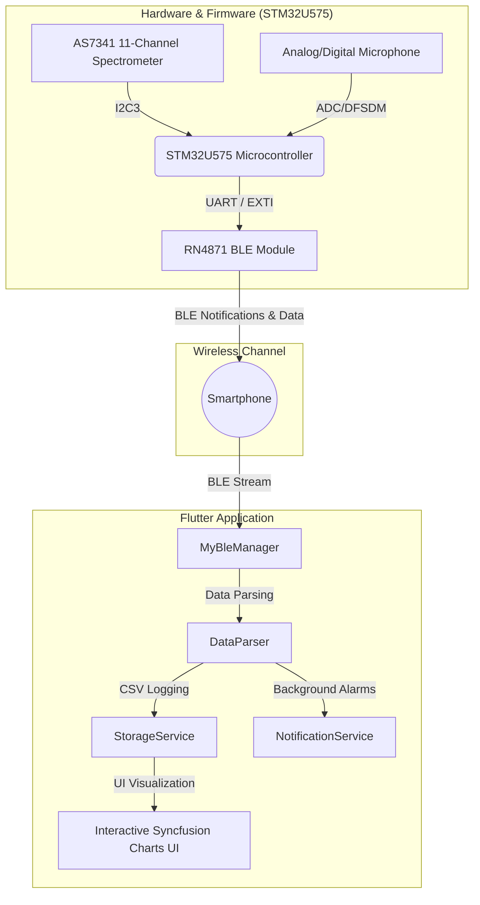

# Smart Wearables Project (SWDP) 🕶️📊

Welcome to the repository of the **Smart Wearables Project (SWDP)**. This project consists of an integrated ecosystem comprising low-level firmware for **STM32** microcontrollers and an interactive, modern **Flutter** mobile application. The system monitors the environment (optical spectrometry and acoustic levels) to estimate user well-being (stress and melatonin inhibition) and notify critical conditions in real time.

---

## 🏗️ Ecosystem Architecture

The project integrates optical and acoustic sensing hardware with a Flutter mobile application via **Bluetooth Low Energy (BLE)** communication.



---

## 🌟 Key Features

### 1. 📡 BLE Connection & Telemetry Stream
The mobile application implements a robust state machine for scanning, pairing, and automatically reconnecting to the **RN4871** BLE module. It handles continuous low-power data streaming and supports asynchronous, packet-based downloads of historical sensor logs stored on the board's local memory.

### 2. 📊 Spectral Monitoring (AS7341)
An 11-channel optical acquisition focusing on key wavelengths:
* **Artificial Light** (flicker/frequency detection)
* **Blue Light (F2 - 440nm)** and **Deep Blue**
* **Clear Light** for global ambient luminous intensity.
Data is plotted dynamically using high-resolution charts powered by the **Syncfusion Flutter Charts** suite.

### 3. 🔊 Acoustic Environmental Monitoring
Real-time measurement and persistence of environmental sound pressure levels in decibels (**dB**), along with acoustic peak detection, to map surrounding noise pollution.

### 4. 🧠 Stress & Melatonin Estimation
A proprietary app-side algorithm cross-references ambient light exposure (especially blue light intensity) and noise levels to estimate:
* **Stress Index**: computed based on ambient noise pollution and excessive light exposure.
* **Melatonin Inhibition**: derived from the 440nm blue light intensity, crucial for evaluating sleep quality and circadian rhythm disruption.


---

## 📂 Repository Directory Structure

Here is the directory layout of the repository and the Flutter mobile application source code:

```text
.
├── assets/
│   ├── spectrometer_data.csv    # Bundled simulated spectrometer log for Demo Mode
│   └── microphone_data.csv      # Bundled simulated microphone log for Demo Mode
├── lib/
│   ├── connection/
│   │   ├── connection_page.dart # UI for BLE scanning, pairing, and connection management
│   │   ├── message_type.dart    # Enum for supported message types (PPG, ECG, HAR, Battery, etc.)
│   │   ├── messages.dart        # Command and sensor data packet structures
│   │   ├── my_ble_manager.dart  # Core BLE manager (scanning, connection, RX packet parsing)
│   │   └── stream.dart          # Stream utilities for continuous data flow
│   ├── services/
│   │   ├── data_parsing.dart    # Structured binary parser for Spectrometer and Microphone dumps
│   │   ├── notification_service.dart # Local push notifications integration via flutter_local_notifications
│   │   └── storage_service.dart # Local persistent storage of CSV logs and asset demo-loaders
│   ├── home_page.dart           # Main tabbed dashboard (supports Demo Mode UI toggle and banner)
│   └── main.dart                # Application entry point (initializes services and graphical themes)
├── generate_mock_data.py        # Python script simulating 8h construction worker shift (CSV, BIN, PNG)
└── pubspec.yaml                 # Flutter configuration (declares csv assets)
```

---

## 🧪 Mock Data Generator & Interactive Demo Mode

To allow testing and demonstration of the application's graphical visualization without requiring a physical STM32 connection, the repository includes a custom simulation and demo environment.

### 1. 🐍 Python Mock Data Generator (`generate_mock_data.py`)
A standalone Python script simulates a realistic **8-hour shift** (08:00 - 16:00) of a construction worker exposed to high noise levels (heavy machinery/drills) and high blue light radiation (outdoor sunlight and electric arc welding):
* **Frequencies:** Generates data points at configurable 10-second intervals.
* **Output Files (saved in `mock_output/`):**
  * `spectrometer_data.csv` and `microphone_data.csv`: Formatted exactly as the local database files expected by the app.
  * `spectrometer_dump.bin` (40.3 KB) and `microphone_dump.bin` (25.9 KB): Raw binary structures mapped to the firmware packets (14-byte and 9-byte records in Little Endian).
  * `sensor_data_visualization.png`: A dark-theme plot visualizing the 8-hour shift profiles (requires `pip install matplotlib`).

### 2. 🧪 In-App Demo Mode
A toggle switch is integrated into the Flutter app to easily switch between live hardware readings and the simulated dataset:
* **Activation:** Tap the **Science/Flask icon** (`Icons.science`) in the top actions bar of the home screen.
* **Visual Indication:** When active, a purple banner (`MODALITÀ DEMO ATTIVA`) is displayed at the top, and all charts load data from the bundled `assets/*.csv` files.
* **Safe Bypass:** Toggling Demo Mode is non-destructive (it does not overwrite actual local logs) and disables BLE download actions to prevent mock/real data interference.

---

## 🚀 Getting Started & Installation Guide

### Prerequisites
* **Flutter SDK**: `>= 3.9.0`
* **Dart SDK**: `^3.9.0`
* A physical smartphone (Android or iOS) with **Bluetooth Low Energy (BLE)** capability and active Location/Bluetooth permissions.

### Flutter Application Setup

1. Clone the repository to your machine:
   ```bash
   git clone https://github.com/X3T4K/SWDP.git
   cd SWDP
   ```

2. Retrieve all dependencies declared in `pubspec.yaml`:
   ```bash
   flutter pub get
   ```

3. Ensure a physical device is connected (recommended for BLE testing) and run the app:
   ```bash
   flutter run
   ```

---

## 📝 Persistent Log Files (CSV)
The application automatically logs data in the secure app-specific directories provided by the operating system:
* `spectrometer_data.csv`: Stores timestamp, clock time (HH:MM:SS), Artificial Light, Blue, DeepBlue, and Clear values.
* `microphone_data.csv`: Stores timestamp, clock time (HH:MM:SS), average dB, and peak acoustic level.

> [!TIP]
> You can retrieve the exact storage path for the CSV logs from the debug console, outputted by logger tags marked `[DataParser]` or `[StorageService]`.

---


## 🤝 Contributing
Pull requests are welcome! For major changes, please open an issue first to discuss what you would like to change.

---

*Developed with ❤️ for the Smart Wearables Design Project (SWDP) course.*
