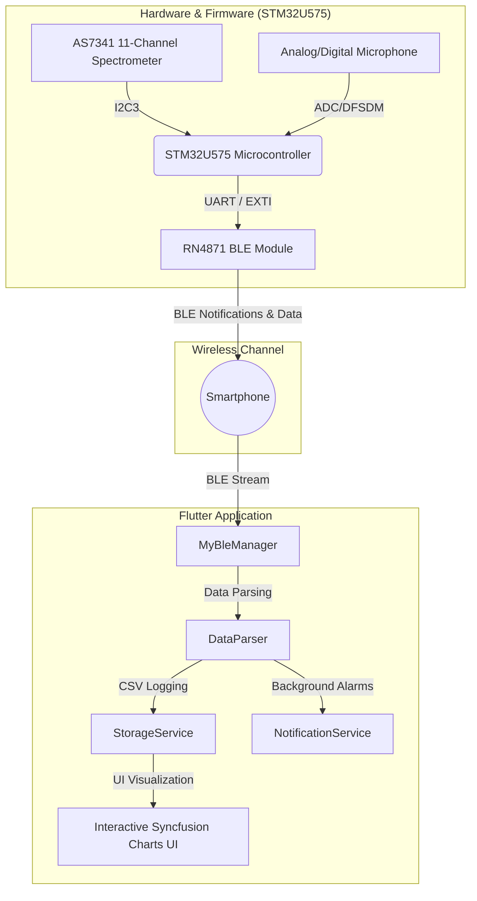

# Smart Wearables Project (SWDP) 🕶️📊

Welcome to the repository of the **Smart Wearables Project (SWDP)**. This project consists of an integrated ecosystem comprising low-level firmware for **STM32** microcontrollers and an interactive, modern **Flutter** mobile application. The system monitors the environment (optical spectrometry and acoustic levels) to estimate user well-being (stress and melatonin inhibition) and notify critical conditions in real time.

---

## 🏗️ Ecosystem Architecture

The project integrates optical and acoustic sensing hardware with a Flutter mobile application via **Bluetooth Low Energy (BLE)** communication.



---

## 🌟 Key Features

### 1. 📡 BLE Connection & Telemetry Stream
The mobile application implements a robust state machine for scanning, pairing, and automatically reconnecting to the **RN4871** BLE module. It handles continuous low-power data streaming and supports asynchronous, packet-based downloads of historical sensor logs stored on the board's local memory.

### 2. 📊 Spectral Monitoring (AS7341)
An 11-channel optical acquisition focusing on key wavelengths:
* **Artificial Light** (flicker/frequency detection)
* **Blue Light (F2 - 440nm)** and **Deep Blue**
* **Clear Light** for global ambient luminous intensity.
Data is plotted dynamically using high-resolution charts powered by the **Syncfusion Flutter Charts** suite.

### 3. 🔊 Acoustic Environmental Monitoring
Real-time measurement and persistence of environmental sound pressure levels in decibels (**dB**), along with acoustic peak detection, to map surrounding noise pollution.

### 4. 🧠 Stress & Melatonin Estimation
A proprietary app-side algorithm cross-references ambient light exposure (especially blue light intensity) and noise levels to estimate:
* **Stress Index**: computed based on ambient noise pollution and excessive light exposure.
* **Melatonin Inhibition**: derived from the 440nm blue light intensity, crucial for evaluating sleep quality and circadian rhythm disruption.

---

## ⚠️ Hardware Alarm "Too Blue" (AS7341 Interrupt)

A standout feature of this project is the ultra-fast, low-power handling of the **"Too Blue"** event. When the user is exposed to excessive blue light (which is harmful to the retina and disrupts sleep), the system triggers an immediate hardware interrupt, bypassing periodic telemetry polling.

> [!IMPORTANT]
> **Interrupt Chain Breakdown:**
> 1. **Hardware Detection (AS7341):** The sensor is configured via the `CFG12` register on the **F2 channel (440nm)** with a high threshold set to **14400** (`0x3840`) and persistence set to **5 cycles** (`PERS` register set to `0x05`) to prevent false positives.
> 2. **Physical Signaling:** When the threshold is exceeded, the sensor's physical `INT` pin is asserted **LOW** (active-low).
> 3. **EXTI Capture (STM32U575):** The pin is routed to port `PB5` on the microcontroller, configured as **EXTI Line 5 (Falling Edge)**. The interrupt is assigned the highest priority in the NVIC.
> 4. **Immediate BLE Notification:** The interrupt service routine (ISR) flags the alert by setting `as7341_int_alarm = 1`. During the next cycle of the finite state machine (FSM) in `main.c`, the microcontroller transmits a special 3-byte packet `[123, 9, 125]` (ASCII: `{ \t }`) via the RN4871 BLE module.
> 5. **Local Notification (Flutter App):** The mobile app's `MyBleManager` intercepts this sequence instantly, clears the alarm signature from the buffer, and fires a native push notification using `NotificationService` to warn the user immediately.

```
+------------------+         INT Pin (LOW)         +--------------------+
|  AS7341 Sensor   | ----------------------------> | STM32U575 (EXTI 5) |
| (F2 > 14400 cnt) |                               +---------+----------+
+------------------+                                         |
                                                    Send alarm via BLE
                                                    [123, 9, 125] ({ \t })
                                                             |
                                                             v
+------------------+       Trigger Notification    +--------------------+
|  User Notified   | <---------------------------- | Flutter App        |
|   "Too Blue!"    |          Local Push           | (MyBleManager RX)  |
+------------------+                               +--------------------+
```

---

## 📂 Repository Directory Structure

Here is the directory layout of the Flutter mobile application source code (`smart_wearables_app`):

```text
lib/
├── connection/
│   ├── connection_page.dart     # UI for BLE scanning, pairing, and connection management
│   ├── message_type.dart        # Enum for supported message types (PPG, ECG, HAR, Battery, etc.)
│   ├── messages.dart            # Command and sensor data packet structures
│   ├── my_ble_manager.dart      # Core BLE manager (scanning, connection, RX packet parsing)
│   └── stream.dart              # Stream utilities for continuous data flow
├── services/
│   ├── data_parsing.dart        # Structured binary parser for Spectrometer and Microphone dumps
│   ├── notification_service.dart# Local push notifications integration via flutter_local_notifications
│   └── storage_service.dart     # Local persistent storage of CSV logs for historical samples
├── home_page.dart               # Main tabbed dashboard (LucePage, SuonoPage, StressMelatoninaPage)
└── main.dart                    # Application entry point (initializes services and graphical themes)
```

---

## 🚀 Getting Started & Installation Guide

### Prerequisites
* **Flutter SDK**: `>= 3.9.0`
* **Dart SDK**: `^3.9.0`
* A physical smartphone (Android or iOS) with **Bluetooth Low Energy (BLE)** capability and active Location/Bluetooth permissions.

### Flutter Application Setup

1. Clone the repository to your machine:
   ```bash
   git clone https://github.com/your-username/SWDP.git
   cd SWDP
   ```

2. Retrieve all dependencies declared in `pubspec.yaml`:
   ```bash
   flutter pub get
   ```

3. Ensure a physical device is connected (recommended for BLE testing) and run the app:
   ```bash
   flutter run
   ```

---

## 📝 Persistent Log Files (CSV)
The application automatically logs data in the secure app-specific directories provided by the operating system:
* `spectrometer_data.csv`: Stores timestamp, clock time (HH:MM:SS), Artificial Light, Blue, DeepBlue, and Clear values.
* `microphone_data.csv`: Stores timestamp, clock time (HH:MM:SS), average dB, and peak acoustic level.

> [!TIP]
> You can retrieve the exact storage path for the CSV logs from the debug console, outputted by logger tags marked `[DataParser]` or `[StorageService]`.

---

## 🛠️ STM32U575 Firmware Integration Notes
The firmware for the companion electronic board must implement:
1. Driver initialization for the **AS7341** spectrometer via I2C (default address `0x39`).
2. Configuration of the `CFG12` register (`0xB5`) to `0x01` to map the F2 channel (440nm) as the spectral interrupt source.
3. EXTI line 5 interrupt routine mapped to pin `PB5` to transmit the special alarm packet `[123, 9, 125]`, and immediately clear the interrupt flag on the spectrometer by reading and rewriting the `STATUS` register (`0x93`).

---

## 🤝 Contributing
Pull requests are welcome! For major changes, please open an issue first to discuss what you would like to change.

---

*Developed with ❤️ for the Smart Wearables Design Project (SWDP) course.*
