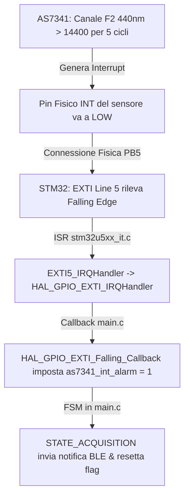

# Relazione Tecnica: Mappatura dell'Interrupt "Troppo Blu" (Spettrometro AS7341)

Questa relazione descrive dettagliatamente il funzionamento e la mappatura dell'interrupt di **"troppo blu"** gestito dallo spettrometro a 11 canali **AS7341** e dal microcontrollore **STM32U575** sulla scheda principale.

L'obiettivo di questa funzionalità è monitorare l'intensità della luce blu e generare un interrupt hardware immediato quando questa supera una determinata soglia critica, notificando istantaneamente il sistema esterno tramite Bluetooth Low Energy (BLE).

---

## 1. Architettura e Flusso dell'Interrupt

Il processo si sviluppa in cinque fasi principali, dal rilevamento ottico sul sensore fino alla notifica wireless:



---

## 2. Configurazione Lato Sensore (AS7341)

Il comportamento dello spettrometro è configurato durante la fase di inizializzazione all'interno della funzione `SPEC_Init()` nel file [Spec_AS7341.c](file:///C:/Users/fanin/SWDP/FirmWare/MainBoard_Firmware/Core/Src/Spec_AS7341.c) tramite le seguenti impostazioni di registro:

### 2.1 Selezione del Canale "Blu" come Sorgente dell'Interrupt
* **Registro `CFG12` (`0xB5`):** Configurato con il valore `0x01`.
  * Nel sensore AS7341, questo registro definisce quale canale spettrale è associato alla logica di interrupt.
  * Il valore `0x01` seleziona il **Canale 1 (F2 - 440nm, Indigo/Deep Blue)**. Questa specifica configurazione rende l'interrupt sensibile alla porzione blu/indaco dello spettro.

### 2.2 Abilitazione dell'Interrupt Spettrale
* **Registro `IEN` (`0xF9` - Interrupt Enable):** Scritto con il valore `0x08`.
  * Il bit 3 corrisponde a **SIEN (Spectral Interrupt Enable)**. Abilitando questo bit, il sensore è autorizzato ad asserire il proprio pin fisico `INT` qualora i valori misurati sul canale F2 superino le soglie configurate.

### 2.3 Soglie di Attivazione (Thresholds)
* **Soglia Alta (High Threshold):** Scritta nei registri `SPEC_REG_SP_TH_H_L` (`0x86`) e `SPEC_REG_SP_TH_H_H` (`0x87`).
  * Valore configurato: **`0x3840`** (pari a **14400** in decimale).
  * Rappresenta il limite massimo oltre il quale scatta la condizione di "troppo blu".
* **Soglia Bassa (Low Threshold):** Scritta nei registri `SPEC_REG_SP_TH_L_L` (`0x84`) e `SPEC_REG_SP_TH_L_H` (`0x85`).
  * Valore configurato: **`0x0000`**.

### 2.4 Controllo della Persistenza (Evitare Falsi Positivi)
* **Registro `PERS` (`0xBD` - Persistence):** Configurato con il valore `0x05`.
  * Definisce quanti cicli di integrazione consecutivi devono registrare un valore fuori soglia prima che l'interrupt venga effettivamente generato sul pin fisico.
  * Il valore `0x05` richiede che il canale F2 (440nm) superi il valore di 14400 per **5 cicli di integrazione consecutivi**, filtrando rumore ottico temporaneo o variazioni rapide transitorie.

---

## 3. Mappatura Hardware e Software Lato Microcontrollore (STM32U575)

Quando il sensore asserisce l'interrupt, il segnale viene propagato ed elaborato dall'hardware e dal firmware dell'STM32U575:

### 3.1 Connessione Fisica ed EXTI
* **Pin STM32:** Il pin fisico di interrupt del sensore è collegato alla porta **GPIOB, Pin 5 (PB5)** dell'STM32.
* **Associazione EXTI:** In conformità con l'architettura STM32, il pin `5` è mappato sulla linea di interrupt esterno **EXTI Line 5**.
* In [main.h](file:///C:/Users/fanin/SWDP/FirmWare/MainBoard_Firmware/Core/Inc/main.h) sono presenti le definizioni:
  ```c
  #define SP_INT_Pin GPIO_PIN_5
  #define SP_INT_GPIO_Port GPIOB
  #define SP_INT_EXTI_IRQn EXTI5_IRQn
  ```
* Il pin è configurato in modalità **Falling Edge** (fronte di discesa), poiché il pin `INT` del sensore AS7341 è di tipo attivo-basso (attivo a livello logico 0).

### 3.2 Priorità dell'Interrupt (NVIC)
Nel file [gpio.c](file:///C:/Users/fanin/SWDP/FirmWare/MainBoard_Firmware/Core/Src/gpio.c), l'interrupt associato è abilitato nel controllore NVIC con priorità massima (`0, 0`):
```c
HAL_NVIC_SetPriority(EXTI5_IRQn, 0, 0);
HAL_NVIC_EnableIRQ(EXTI5_IRQn);
```

### 3.3 Routine di Servizio dell'Interrupt (ISR)
Quando si verifica il fronte di discesa su PB5, la CPU salta alla routine a basso livello nel file [stm32u5xx_it.c](file:///C:/Users/fanin/SWDP/FirmWare/MainBoard_Firmware/Core/Src/stm32u5xx_it.c):
```c
void EXTI5_IRQHandler(void)
{
  HAL_GPIO_EXTI_IRQHandler(SP_INT_Pin);
}
```
`HAL_GPIO_EXTI_IRQHandler()` si occupa di resettare il flag hardware di interrupt pendente a livello di registro EXTI e inoltra la chiamata alle funzioni di callback dell'Hardware Abstraction Layer (HAL).

### 3.4 Gestione nella Callback Software
La notifica viene intercettata dalla callback implementata nel file [main.c](file:///C:/Users/fanin/SWDP/FirmWare/MainBoard_Firmware/Core/Src/main.c):
```c
void HAL_GPIO_EXTI_Falling_Callback(uint16_t GPIO_Pin)
{
    if (GPIO_Pin == SP_INT_Pin)
    {
        as7341_int_alarm = 1;
        printf("[DEBUG] Spectrometer EXTI5 Interrupt Fired! (as7341_int_alarm=1)\n");
    }
}
```
La callback imposta a `1` la variabile globale volatile `as7341_int_alarm`, agendo da semaforo per il ciclo principale.

---

## 4. Reazione del Sistema e Notifica BLE

La variabile `as7341_int_alarm` viene periodicamente controllata dalla macchina a stati (FSM) principale all'interno del ciclo `while(1)` in `main.c`, nello specifico quando il sistema si trova in modalità di acquisizione attiva (`STATE_ACQUISITION`):

```c
case STATE_ACQUISITION:
    if (lpbam_cycle_complete) {
        // ... Gestione normale del completamento del ciclo di acquisizione ...
    }
    else if (as7341_int_alarm)
    {
        // Caso 2: L'interrupt di soglia è arrivato, avverte subito via BLE
        uint8_t AS7341_TRESHOLD[] = {[0] = 123, [1] = 9, [2] = 125}; 
        BLE_SendData(AS7341_TRESHOLD, sizeof(AS7341_TRESHOLD));
        
        printf("[BLE] Soglia superata\n"); // invia la notifica attraverso BLE
        
        as7341_int_alarm = 0; // Resetta la bandierina
    }
    break;
```

### 4.1 Payload della Notifica BLE
Quando la soglia di luce blu viene superata:
1. Viene creato un pacchetto dati a 3 byte denominato `AS7341_TRESHOLD` con valori costanti:
   * `AS7341_TRESHOLD[0] = 123` (carattere ASCII `{`)
   * `AS7341_TRESHOLD[1] = 9` (carattere ASCII `\t` - tabulazione orizzontale)
   * `AS7341_TRESHOLD[2] = 125` (carattere ASCII `}`)
2. Il pacchetto viene inviato via radio sfruttando il modulo Bluetooth Low Energy (RN4871) tramite la funzione `BLE_SendData()`.
3. Viene visualizzato a console di debug seriale il messaggio `[BLE] Soglia superata`.
4. La variabile `as7341_int_alarm` viene infine azzerata per consentire il rilevamento di allarmi successivi.

---

## 5. Ripristino e Pulizia dell'Interrupt sul Sensore

Affinché il pin `INT` del sensore possa tornare a livello logico alto (rilasciando la linea per interrupt futuri), il flag di interrupt interno all'AS7341 (`AINT`) deve essere resettato esplicitamente via software. 

Il protocollo del sensore prevede un meccanismo **Write 1 to Clear** (W1C):
1. Si esegue una lettura del registro `STATUS` (`0x93`) per rilevare i flag attivi.
2. Si riscrive lo stesso identico valore letto all'interno dello stesso registro.
3. Il sensore resetta i flag corrispondenti ai bit scritti a `1`, rilasciando fisicamente la linea hardware.

Questo processo di pulizia viene eseguito sia all'avvio in `SPEC_Init()`, sia periodicamente durante i cicli di scarico dati regolari in `STATE_ACQUISITION`:
```c
// Pulisce l'interrupt sul sensore AS7341
uint8_t status_reg = 0;
// Legge lo stato (e i flag degli interrupt attivi)
HAL_I2C_Mem_Read(&hi2c3, SPEC_I2C_ADDR, 0x93, I2C_MEMADD_SIZE_8BIT, &status_reg, 1, HAL_MAX_DELAY);
// Riscrive lo stesso valore. I bit a "1" verranno azzerati dal sensore
HAL_I2C_Mem_Write(&hi2c3, SPEC_I2C_ADDR, 0x93, I2C_MEMADD_SIZE_8BIT, &status_reg, 1, HAL_MAX_DELAY);
```
